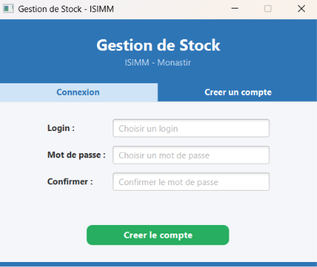
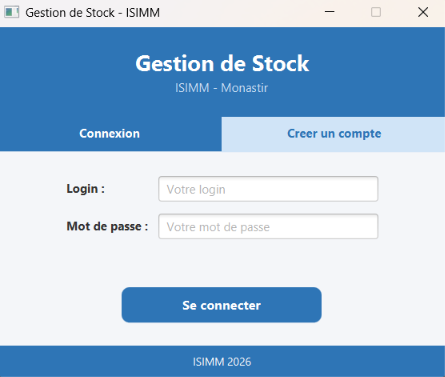
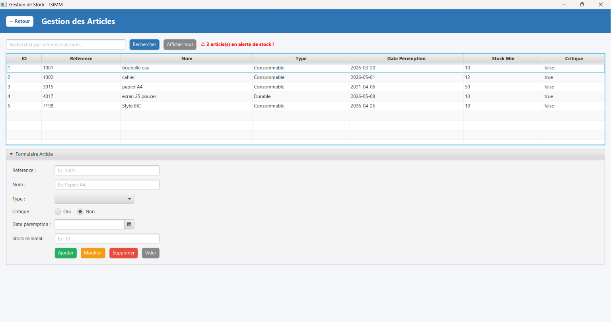
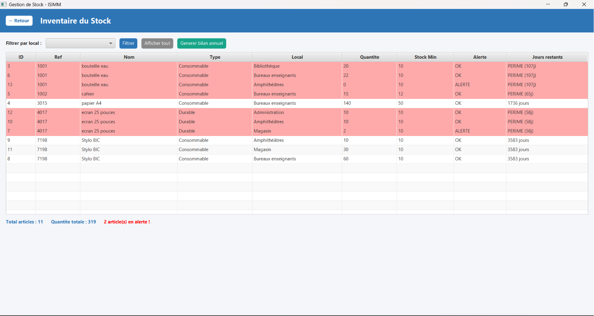
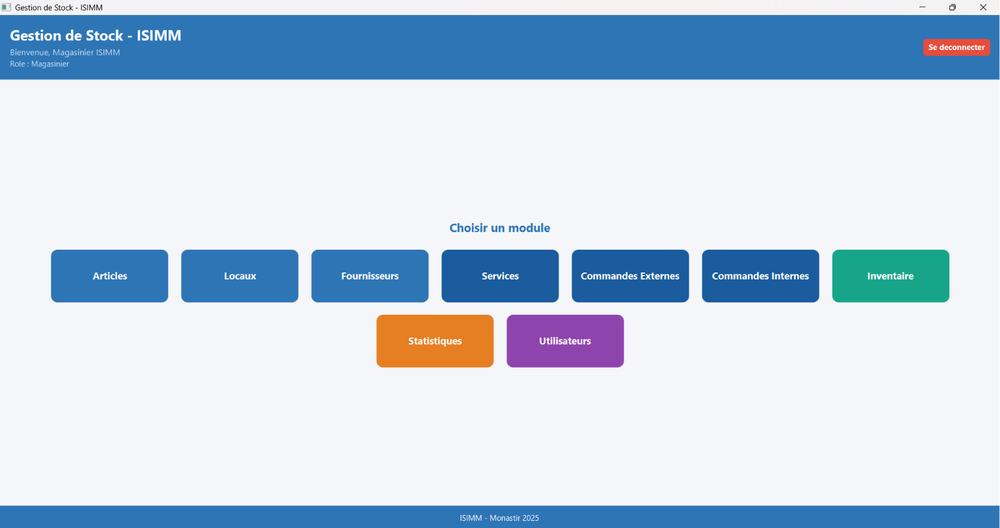
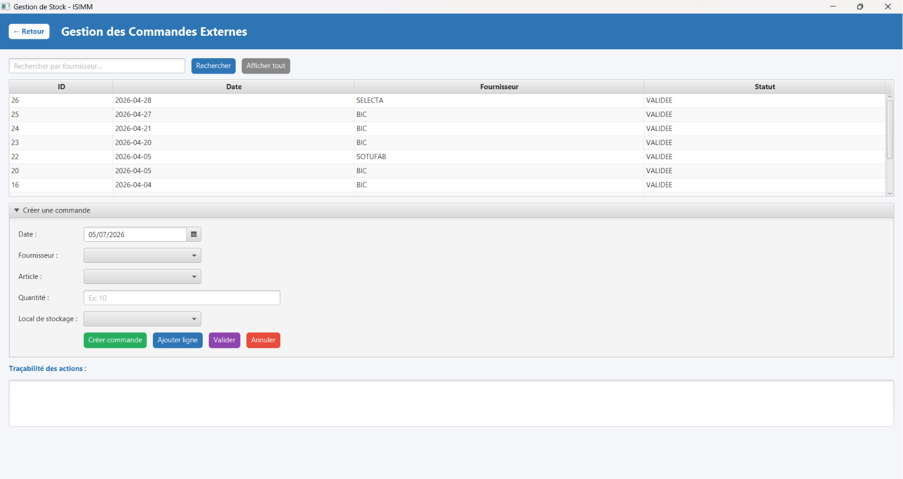

# Stock Management System

Academic inventory management system developed using Java, JavaFX and PostgreSQL.

---

## 📌 Description

This is a desktop application for managing stock in an organization.  
It allows users to manage products, suppliers, orders, and inventory through a JavaFX graphical interface.

This project was developed for academic purposes to practice software engineering concepts.

---

## ⚙️ Features

- Product management (add, update, delete)
- Supplier management
- Internal and external orders
- Inventory tracking
- User authentication system
- PostgreSQL database integration

---

## 🛠️ Technologies Used

- Java
- JavaFX
- PostgreSQL
- JDBC
- MVC Architecture
- DAO Pattern

---

## 📷 Screenshots

---

## 🎓 Purpose

This project was created as an academic exercise to improve skills in:
- Object-Oriented Programming (OOP)
- Desktop application development
- Database design and integration
- Software architecture (MVC + DAO)

---

## ⚠️ Note

This is an academic project and not intended for production use.
